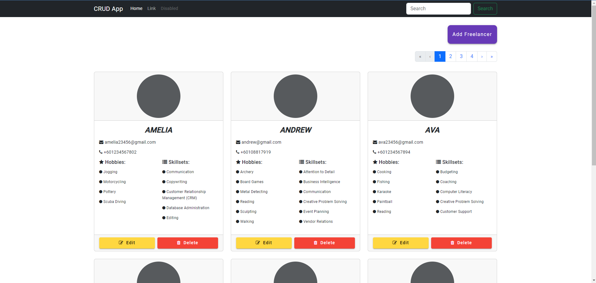
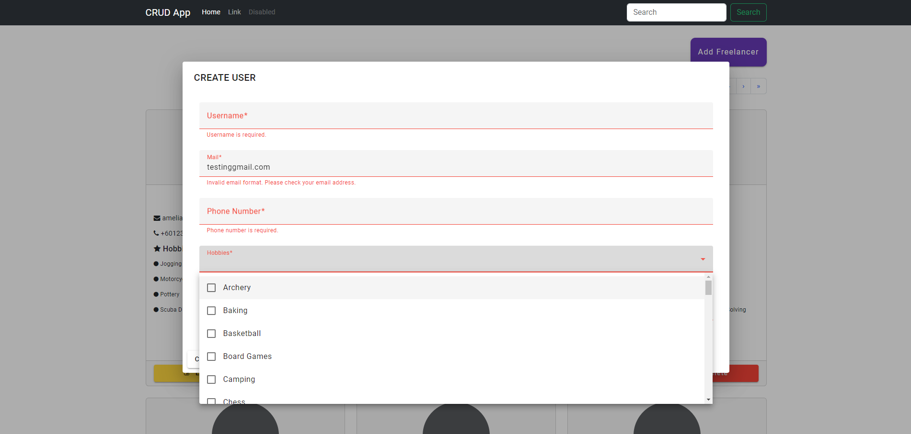
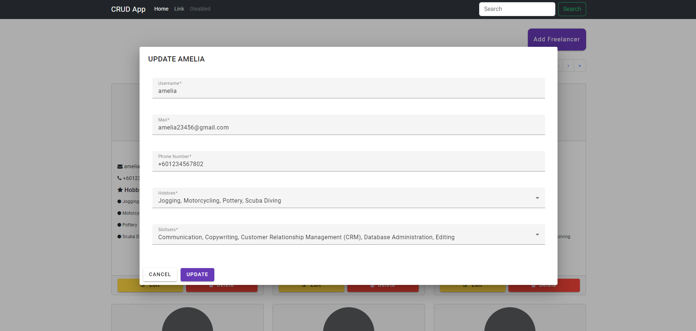
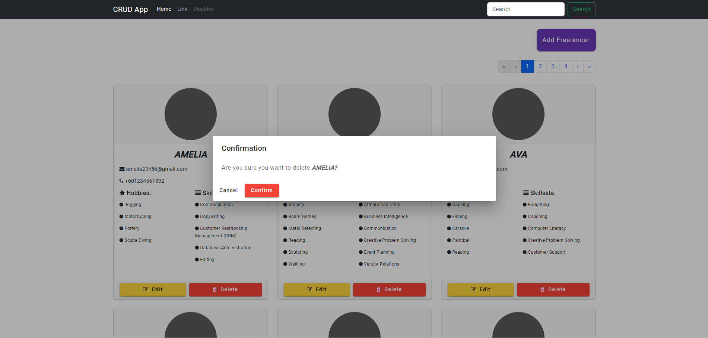
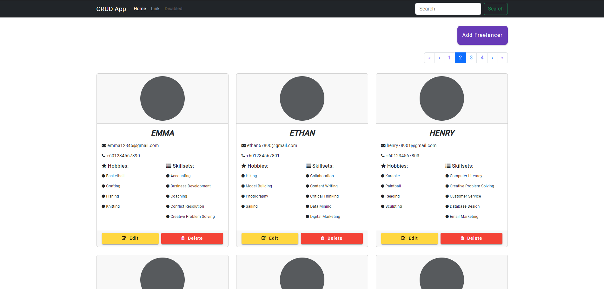

# Angular_NetCore_CRUD

This project demonstrates a basic implementation of Create, Read, Update, and Delete operations using .NET Core WebApi and Angular.  (Directory of Freelancer)

## Knowledge
- MVC Pattern of RESTful API
- RDBMS (SQLite)
- IUnitOfWork, DTO, Seeding, Error Handling
- Pagination

## System Images






## Getting Started

To get started with the project, follow these steps:

### Prerequisites

- [.NET Core SDK](https://dotnet.microsoft.com/download) (Make sure to verify installation by running `dotnet --version` after installation)
- [Node.js](https://nodejs.org/) (Includes npm)
- [Angular CLI](https://angular.io/cli) (Install globally using `npm install -g @angular/cli`) & Angular Development Server (`npm install @angular-devkit/build-angular`)


### Installation

1. **Download & Unzip the Project Folder**: Download the project folder and unzip it to your desired location.

2. **Open with Visual Studio Code**: Open the entire project folder in Visual Studio Code.

#### You Might Need to Install SQLite Extension in Visual Studio Code to Open & View Database

3. **Open Terminal**: Open two command-line terminals within Visual Studio Code.

### Setting up the WebApi (CRUDAPI)

1. In the first terminal, navigate to the `CRUDAPI` directory:
```
cd CRUDAPI
```
   
2. Add migrations for the database:
```
dotnet ef migrations add InitialCreate -o Data/Migrations
```
   
3. Update the database with the applied migrations:
```
dotnet ef database update
```
   
4. Seed initial data into the database:
```
dotnet watch --no-hot-reload
```
   
### Setting up the Angular Frontend (CRUD)
1. In the second terminal, navigate to the CRUD directory:
```
cd CRUD
```
   
2. Serve the Angular application:
```
ng serve
```
   
> [!NOTE]
> If you encounter dotnet or ng command not found errors, make sure you have installed the required SDKs (.NET Core SDK and Node.js) and tools (Angular CLI) as mentioned in the prerequisites.
> For more information on .NET Core and Angular, refer to the official documentation:
> 
>   - [.NET Core Documentation](https://learn.microsoft.com/en-us/aspnet/core/?view=aspnetcore-8.0)
> 
>   - [Angular Documentation](https://angular.io/docs)
